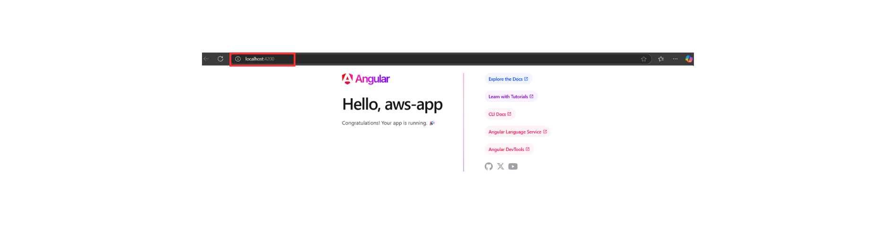
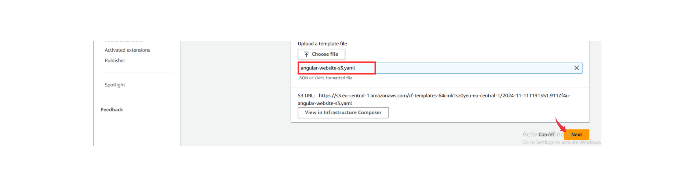
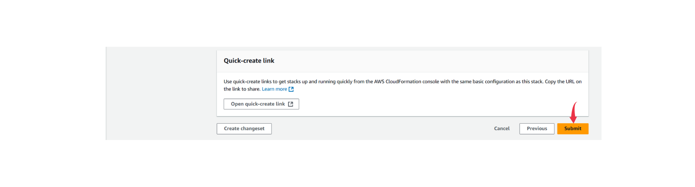
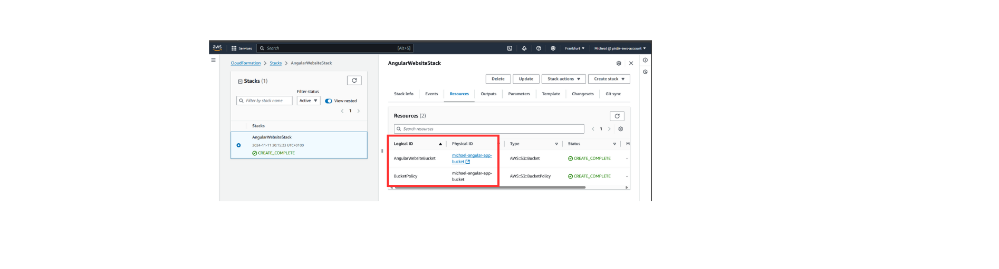
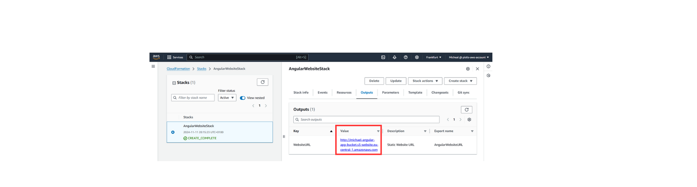
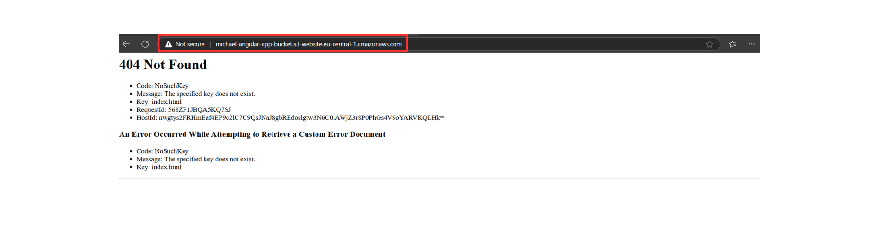
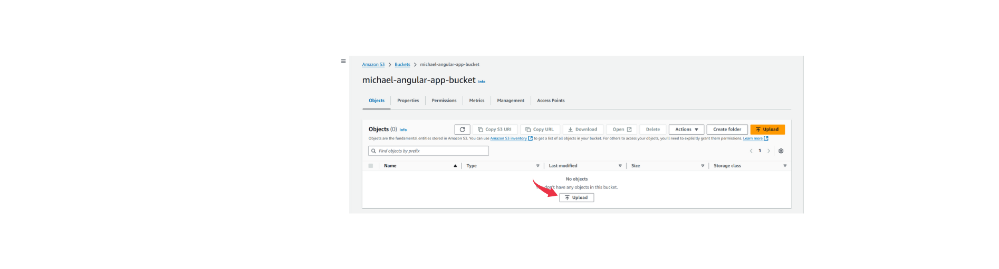
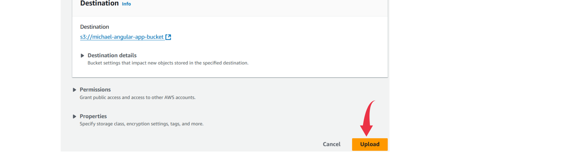
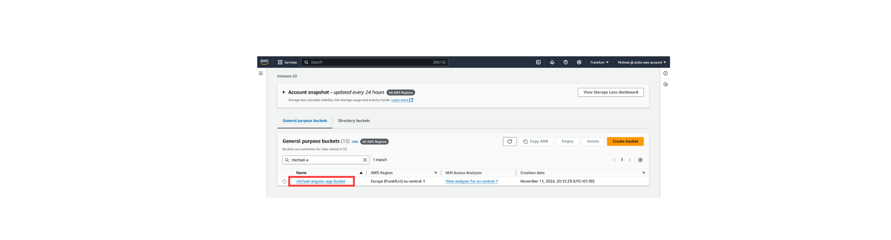
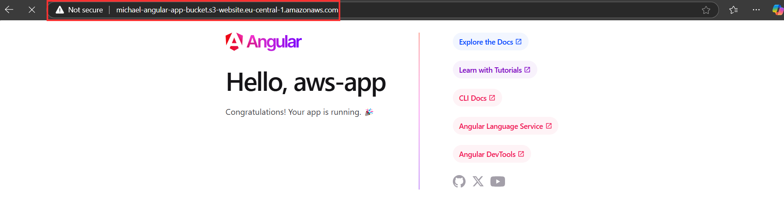

Why use AWS S3 Bucket?

- S3 is a highly affordable storage solution. You only pay for the storage you use, and there are no upfront costs or infrastructure setup fees.
- S3 automatically scales to meet traffic demands. Whether you have a few hundred or millions of users accessing your files, S3 can handle the load without manual intervention.
- No server management is required for using S3 This saves time and costs associated with maintaining servers.
- Many dynamic websites allow users to upload images, files, or videos. You can upload user-generated content directly to S3, minimizing the load on the web server and reducing the need for additional storage infrastructure.

```bash
# create a parent folder 
mkdir StaticWebsiteToS3
cd StaticWebsiteToS3

# initialize a git repository
git init

# create a folder that stores CloudFormation templates
mkdir cloudformation 

# create a folder that stores static website source code
mkdir frontend 
```

Angular requires Node.js and npm, so ensure you have them installed.

Check if Node.js and npm are installed:
```bash
node -v
npm -v
```

> You can download and install the latest version from [nodejs.org.](https://nodejs.org/en)
> 
> Alternatively, to download Node.js directly from your command line, you can use a package manager that suits your operating system. For ubuntu use `apt`, for MacOs use `brew`, for Windows use `choco`

For Ubuntu/Debian
Step 1: Install Node.js and npm

```bash
sudo apt update
sudo apt install -y nodejs npm
```

Step 2: Install the Angular CLI
```bash
npm install -g @angular/cli
ng version # Verify the installation
```
Step 3: Create a New Angular App
```bash
ng new aws-app
```
*Choose y, SCSS, and y respectively for the prompts that appear.*

Run the folllowing afterwards
```bash
cd aws-app
ng serve
```

By default, the application will be available at http://localhost:4200. Open your browser and navigate to that address to view your Angular app. You can aftwerwards customize the website as you wish. 



Let's go ahead to the our application
```bash
ng build
```

The build files will be created into ./dist/aws-app folder by default.

## Building our CloudFormation Template

First we specify that this CloudFormation template should use the format version established in 2010-09-09 and then goa ahead to give a high-level description of the purpose.

```yaml
AWSTemplateFormatVersion: "2010-09-09"
Description: CloudFormation Template for Hosting an Angular Static Website on S3 with Public Access
```

The Parameters section allows us to input a custom bucket name (BucketName) when deploying the stack; it restricts the name to lowercase letters, numbers, dots, and hyphens via the `AllowedPattern` in order to align with S3’s naming conventions.

```yaml
Parameters:
  BucketName:
    Type: String
    Description: "Name of the S3 bucket to host the Angular website"
    AllowedPattern: "^[a-z0-9.-]+$"
    ConstraintDescription: "The bucket name can only contain lowercase letters, numbers, dots, and hyphens."
```

Next is the Resources section, where we defined `AngularWebsiteBucket` as the S3 bucket that will host the website, and the configured properties to allow public access and define the website's entry point as index.html, while routing errors to the same page to handle client-side routing. The `PublicAccessBlockConfiguration` configuration disables restrictive access settings, specifically allowing public bucket policies and ACLs, which is necessary for public website hosting on S3. The `WebsiteConfiguration` property in AngularWebsiteBucket specifies that index.html serves as the homepage (IndexDocument), while also routing all errors to index.html as the ErrorDocument, so Angular's router can handle navigation paths without triggering 404 errors.

```yaml
Resources:
  AngularWebsiteBucket:
    Type: AWS::S3::Bucket
    Properties:
      BucketName: !Ref BucketName
      PublicAccessBlockConfiguration: 
        BlockPublicAcls: false
        BlockPublicPolicy: false
        IgnorePublicAcls: false
        RestrictPublicBuckets: false
      WebsiteConfiguration:
        IndexDocument: index.html
        ErrorDocument: index.html
```

The `BucketPolicy` resource defines a public policy for the S3 bucket, granting everyone (Principal: "*") permission to perform s3:GetObject actions on all objects within the bucket, allowing public read access to all site files. The `DependsOn` attribute in BucketPolicy ensures that the AngularWebsiteBucket is fully created and configured before the bucket policy is applied, establishing the correct order of resource creation.

```yaml
  BucketPolicy:
    Type: AWS::S3::BucketPolicy
    Properties:
      Bucket: !Ref AngularWebsiteBucket
      PolicyDocument:
        Version: "2012-10-17"
        Statement:
          - Sid: "PublicReadGetObject"
            Effect: Allow
            Principal: "*"
            Action: "s3:GetObject"
            Resource: !Sub "${AngularWebsiteBucket.Arn}/*"
    DependsOn: AngularWebsiteBucket  # Ensures the bucket is created and configured before applying the policy
```

Finally, the Outputs section provides a WebsiteURL output, which gives the S3 static website endpoint URL after the stack is created, making it easy to access and verify our hosted Angular app.

```yaml
Outputs:
  WebsiteURL:
    Description: "Static Website URL"
    Value: !GetAtt AngularWebsiteBucket.WebsiteURL
    Export:
      Name: AngularWebsiteURL
```

Let's add the template we just created into `angular-website-s3.yaml`
```bash
cd cloudformation
touch angular-website-s3.yaml
```

We are ready to upload our CloudFormation template on aws. On the AWS console search bar, navigate to CloudFormation and follow the steps as shown in the images below. We will be skipping steps 2 and 3 of the stack creation process.











Our CloudFormation upload is a success! Now navigate to the "Outputs" section to see our S3 bucket URL.




Open the link in a new browser tab and for now you should an `Error 404` message. This is because we haven't upload our web files to the bucket. Now let's go ahed to that.




Via AWS Console search bar navigate to our S3 bucket and upload all the files from dist/app-for-aws folder:









Now refresh the website link - our Angular app should be up and running:




You might get charged for any resources you leave running, so it’s a good idea to clean everything up once you’re done with your stack. When you delete the stack, all its resources will be deleted too.

Heads up: CloudFormation won’t delete an S3 bucket if there are still files in it. Make sure to empty the bucket first.


In this project, we set up a basic static website and hosted it on an S3 bucket. We went through the steps to manually upload the files to S3. But ideally, we’d want a tool that automatically rebuilds and uploads files to S3 whenever there’s a code change. In the next project, I’ll show you how to automate this with AWS CodeBuild. 


